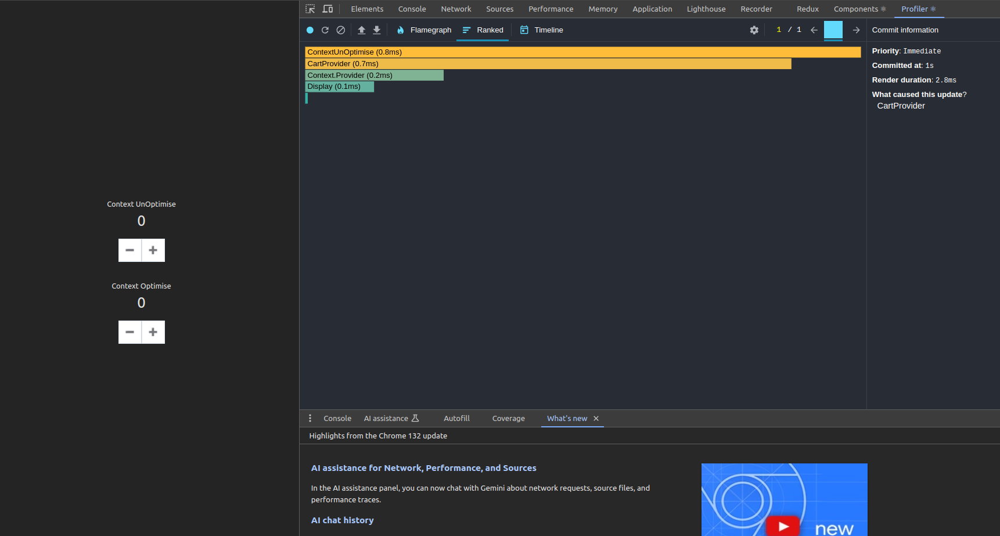
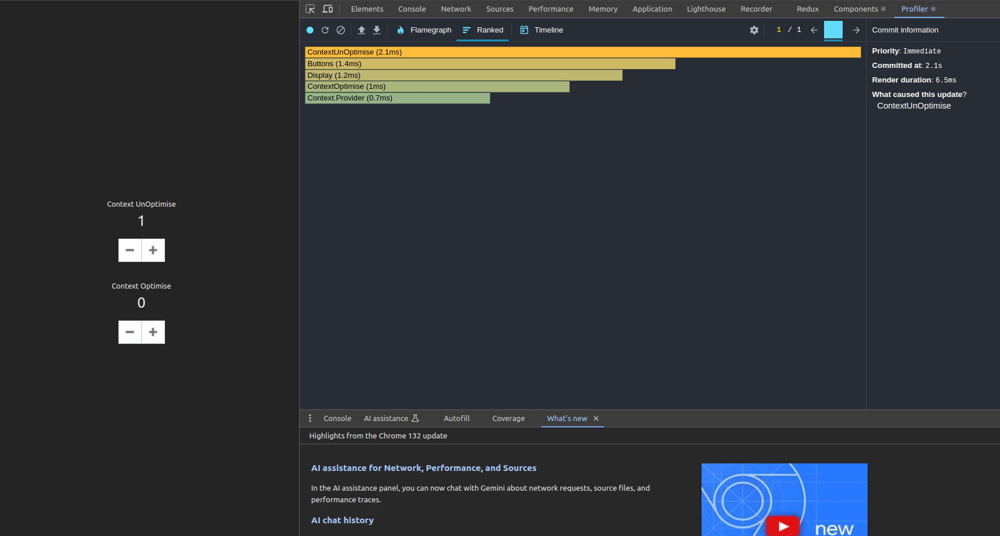

## Key: 

By separating the context into state context and dispatcher context, they will not rerender components that only use dispatcher context.

When the state changes, it only renders child components that use state context

### Optimise: 
Component Button doesnt rerender when update state

### Unoptimise: 
Component Button rerender when update state

