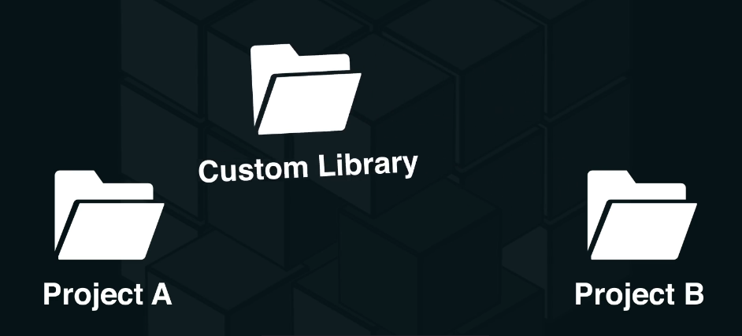

## Mono Repo

Sử dụng mono repo khi chúng ta muốn share library cho toàn bộ projects : 

Props :
- Giả sử chúng ta tự build library lodash và share cho toàn bộ project sử dụng 
    - Khi có bug ở thư viện, chúng ta cần update thư viện lodash thì việc update code ở thư viện sẽ cần update toàn bộ npm package ở toàn bộ project còn lại.
    - Đối với monorepo chúng linked tới 1 modules chính vì vậy khi sửa code ở lodash sẽ không cần update toàn bộ version cho các project còn lại
Cons : 

### 1. Core mono repo principle 
### 2. Basic structure patterns
### 3. Advanced structure patterns
### 4. NodeJS & NPM tips
### 5. Helpful tool and libraries
### 6. MonoRepo 
- Đây là kiến trúc được sử dụng bởi 